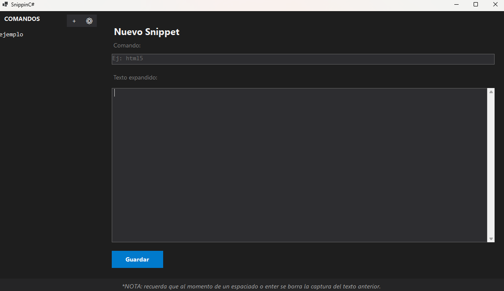
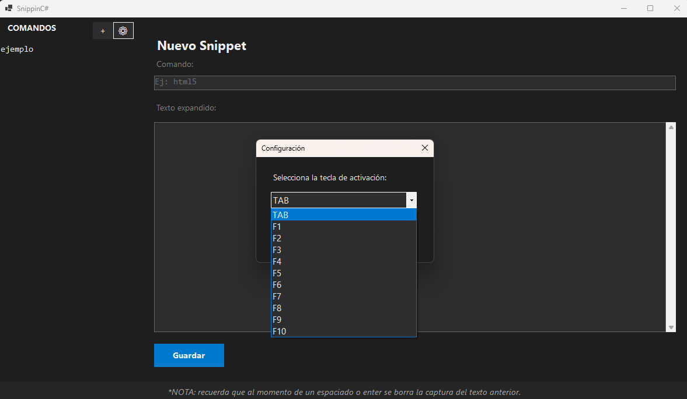
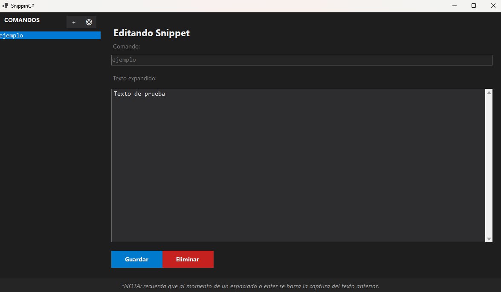

# ⚡ SnippinC#

Una aplicación de escritorio ligera desarrollada en **C# (.NET / Windows Forms)** diseñada para optimizar la productividad mediante la expansión automática de fragmentos de texto (*snippets*) en tiempo real utilizando ganchos de teclado globales (*Global Keyboard Hooks*).

## 🚀 Características Principales

* **Modo Oscuro Moderno:** Interfaz minimalista diseñada para reducir la fatiga visual.
* **Expansión Global:** Funciona de manera fluida en cualquier software de Windows (editores de código, navegadores, mensajería, etc.).
* **Gestión Dinámica:** Añade, edita o elimina abreviaturas al instante desde una interfaz responsiva.
* **Personalización de Teclas:** Configura la tecla de activación según tus preferencias (`TAB`, `F1` hasta `F10`).
* **Persistencia en JSON:** Los comandos se almacenan de forma local y segura en un archivo `command.json`.

## 📸 Vistas Previas

| Interfaz Principal | Panel de Configuración | Gestión de Comandos |
| :---: | :---: | :---: |
|  |  |  |

## ⚙️ Requisitos del Sistema

* **Sistema Operativo:** Windows 10 o Windows 11.
* **Entorno:** [.NET 8.0 SDK](https://dotnet.microsoft.com/download/dotnet/8.0) (o .NET 6.0+).

## 🛠️ Instalación y Ejecución

1. Clona el repositorio en tu equipo:
   ```bash
   git clone https://github.com/nezts08/SnippinCS.git